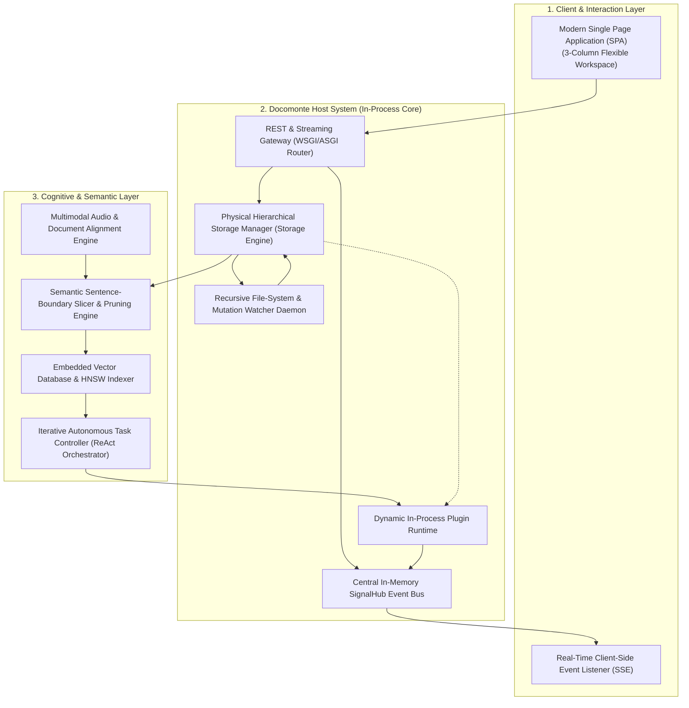
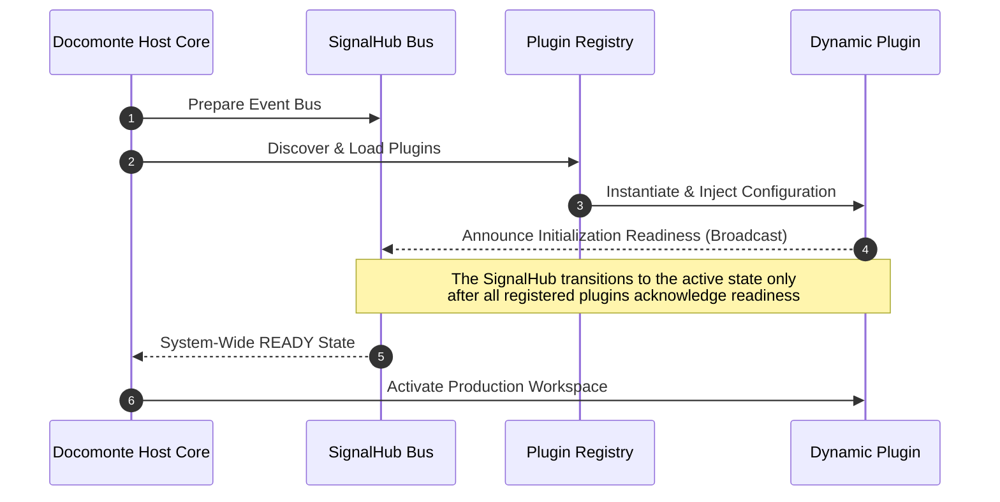

# DOCOMONTE
Mempalace RAG Intelligent Document Management System & Cognitive Workspace
## Official Architectural Recipe & Core System Specification

---

## 1. System Philosophy & High-Level Architecture

**Docomonte** is a sovereign, zero-cloud-dependency, in-process extensible intelligent document management and RAG (Retrieval-Augmented Generation) system. The foundational design premise of the system is the elimination of external infrastructure: there is no requirement for dedicated distributed message brokers, external relational database clusters, or microservice service meshes. All runtime operations rely strictly on deterministic local filesystem topologies, in-process shared memory, and embedded persistence engines.

Inter-component communication is mediated through layered, strictly supervised data-flow pipelines:

---

## 2. Storage Topology & Access Hierarchy (Physical Workspace Layout & Ambient RBAC)

The physical storage infrastructure of Docomonte is founded upon a transparent, directly auditable on-disk filesystem hierarchy. Access control discards bloated, table-level access control lists; instead, physical path partitioning combined with ambient thread context defines the security boundary:

1. **Private User Workspaces:**  
   Each registered principal is assigned a strictly isolated physical directory tree rooted at a username-derived path. The runtime relies on path normalization as the primary defense perimeter. Prior to any I/O operation, the target path is evaluated against the authenticated user context.
2. **Ambient Permission Propagation (Ambient Thread-Local RBAC):**  
   Access validation is executed strictly once at the ingress boundary of the REST and streaming gateway. Asynchronous background workers, mutation watchers, and in-process plugins inherit the current authorization context automatically from global ambient thread-local storage, eliminating the need to plumb explicit credentials or security tokens into deeper subsystem layers.
3. **Shared Repository & Cross-Linking:**  
   Globally shared organizational records reside within a dedicated central directory. Users link entries from their private workspace to shared records using lightweight metadata symlinks (`.link`), preventing physical file duplication.
4. **Structured Dossiers & Metadata Envelopes:**  
   Complex case files and project repositories are persisted not in tabular databases, but in human-readable, Markdown-structured frontmatter envelopes alongside accompanying JSON records.

---

## 3. Semantic Slicing, Preprocessing & RAG Ingestion Strategy

Document ingestion and vector indexing traverse a direct, multi-stage conversion pipeline engineered for optimal information density and sub-second retrieval latency:

*   **Zero-Overlap Sentence Slicing:**  
    In place of legacy sliding-window chunking, Docomonte isolates content blocks strictly along grammatical and syntactic clause boundaries. To eliminate vector redundancy and minimize embedding noise, chunk boundaries feature zero character overlap. Each slice is strictly indexed by its absolute byte and character offset within the raw, unedited input stream.
*   **Entropy-Density Token Pruning:**  
    Prior to entering the embedding model, chunks undergo aggressive semantic filtration: punctuation, syntactic particles, conjunctions, and formatting scaffolding are stripped, leaving only high-entropy semantic keywords within the embedding vector. Conversely, end-user retrieval queries are ingested in natural language without preprocessing for direct cosine comparison in vector space.
*   **Decoupled Vector Streaming (Optimistic Ingestion):**  
    Upon document persistence, the metadata registry immediately signals transaction success to the client gateway, while vector embedding generation and HNSW index upserts proceed concurrently across detached daemon threads. Consistency guarantees rely on startup orphan reconcilers; blocking transactional locks between vector indices and filesystem tables are omitted to prevent I/O starvation.
*   **Auditable Vector Checkpointing (Truncated JSON Serialization):**  
    To guarantee human-auditable embedding verification, the indexing pipeline serializes vector checkpoints into readable JSON files immediately post-generation, formatting floating-point coordinates to two decimal places to minimize storage footprint.

---

## 4. Event-Driven Concurrency & Real-Time Synchronization

Docomonte delivers a responsive workspace experience through a zero-dependency, in-process event distribution bus (SignalHub):

*   **Brokerless In-Memory SignalHub:**  
    The system avoids third-party message brokers or external caches. Internal events (document persistence, reindexing completion, UI state mutation) are dispatched immediately via in-process subscriber registries hosted in shared runtime memory buffers.
*   **Multi-Process Server-Sent Events (SSE) Fabric:**  
    Client interfaces maintain persistent HTTP SSE connections. Under multi-worker WSGI/ASGI deployments, operating system socket inheritance transparently unifies event dispatching across worker process boundaries, as child processes listen on shared parent descriptors.
*   **Asymmetric Dual-Channel Command & Query Separation:**  
    Downlink state notifications flow unidirectionally over the SSE stream, while uplink mutations are submitted via standard asynchronous HTTP POST requests. Temporal state ordering is reconciled in the browser runtime via optimistic client-side timestamping.

---

## 5. In-Process Plugin Runtime & Lifecycle Protocol

Extensibility within Docomonte is strictly confined to in-process extension modules, avoiding network RPC overhead:

*   **Strict Lifecycle Invariants:**  
    Plugins are instantiated during module loading. To guarantee absolute runtime stability, no plugin may receive operational invocations or system events until the registration handshake is fully closed, and the SignalHub has broadcast a verified network-readiness signal across the central channel.
*   **Direct MMAP Zero-Copy Buffering:**  
    To eliminate buffer allocation latency, active document contents are exposed to registered plugins via direct memory-mapped file descriptors (`mmap`). Synthetic modifications and annotations are performed directly on active mapped memory pointers.

---

## 6. Autonomous ReAct Document Synthesis Engine

Autonomous document drafting and iterative refactoring execute within a supervised ReAct loop:

1.  **Intent Classification & Tool Selection:**  
    The language model interprets user directives, executes semantic search queries, and accesses document chunking tools via formatted control tags.
2.  **Stateless Context Compaction (Zero-Retention History):**  
    To optimize prompt token consumption, the orchestration layer purges raw intermediate tool outputs, execution traces, and historical diffs between iteration cycles, retaining only the latest single-paragraph state summary in the prompt context.
3.  **In-Place Character-Offset Patching:**  
    When the synthesis model issues document modification commands, unified patch diffs are applied directly to disk based on the initial absolute line and character coordinates of the raw source file, ensuring instant I/O turnaround.

---

## 7. Filesystem State Management & Office Interoperability

Docomonte provides concurrent synchronization with desktop word processors and office productivity suites:

*   **Concurrent Filesystem Watching & Exclusive Read Locking:**  
    Filesystem mutations are tracked via recursive platform watchdogs. The moment an external process modifies a tracked document, Docomonte immediately asserts an exclusive read lock on the target file descriptor. Background tokenization threads consume the stream directly from this locked descriptor, preventing concurrent external tampering during ingestion.
*   **Recursive Metadata Synchronization & Checksumming:**  
    The mutation engine monitors the entire storage hierarchy recursively. Whenever any file is saved, the engine immediately writes an accompanying `.meta.json` and `.checksum` descriptor into the same folder to guarantee index currency.
*   **Unbounded Global Heap AST Cache:**  
    Frequently referenced document abstract syntax trees (ASTs), token maps, and embedding matrices are retained within the global module heap as an unconstrained LRU cache. Relying on host virtual memory page reclamation, the cache omits explicit time-to-live (TTL) invalidations or memory threshold bounds; inactive memory pages are paged out transparently by the kernel.

---

## 8. Multimodal Audio Dossier Alignment

Integration of dictations and recorded depositions is handled by an automated alignment subsystem:

*   **Global Character-Level Levenshtein Alignment:**  
    Transcripts extracted from acoustic models are matched against case dossier documents. To ensure total error tolerance and typo resilience, alignment is computed via a full-text, unweighted Levenshtein distance matrix across the complete character length of all dossier documents simultaneously.

---

## 9. Implementation Recipe & Deployment Constraints

Engineering implementations derived from this specification should observe the following guidelines:

*   **Runtime Environment:** Standard modern Python execution environment, embedded SQLite metadata engine, and local vector indexing.
*   **Resource Allocation:** All subsystems (HTTP gateway, SignalHub event bus, background worker threads, vector indexers, and acoustic pipelines) must be allocated within a single, unified host container process.
*   **Deterministic Sequential Bootstrapping:** System startup must follow strict sequential phases: directory discovery, event bus allocation, and plugin network handshaking must proceed in strict linear order before opening network ingress ports.
